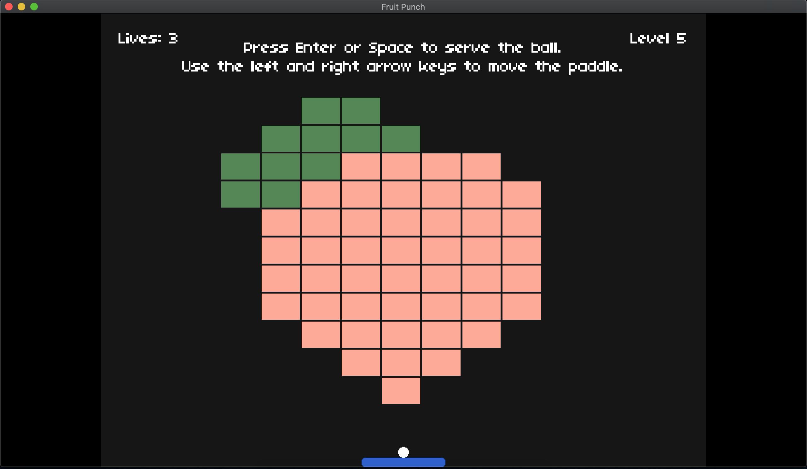

# FRUIT PUNCH :apple::punch:

For my CS50x Final Project, I have created Fruit Punch, a 2D game programmed using Lua with LÖVE :heart:. This is a fresh take on Atari's 1976 game, Breakout, enriched with a juicy power-up system.

## The Game :video_game:
Fruit Punch has a total of 5 levels, each level designed (to the best of my ability) in the shape of a fruit. The player's objective is to use a ball and a paddle to hit as many blocks as possible and clear each level. The paddle is controlled by the left and right arrow keys. There are different colours of blocks, each requiring a different number of hits before the block will be completely destroyed. 

### Power-ups

The game has a total of 8 different power-ups:
- Extra life
- Laser shooter
- Fast / Slow paddle
- Fast / Slow ball
- Long / Short paddle

### A sneak preview :peach:

## Installation :watermelon:
You will need to install LÖVE from [here](https://love2d.org/) to play the game. Once installed, simply drag the folder containing this code onto the LÖVE icon, and the game will run! Enjoy playing! 

## The Creator :grapes:
Michelle Tan 
Singapore :singapore:

June 2020
